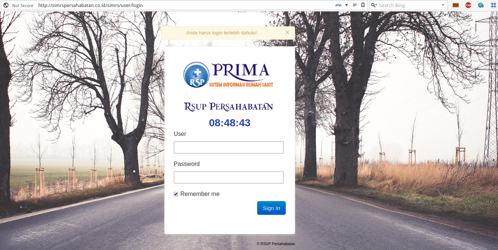

## Login

**Bismillahirrohmanirohim..**  

Untuk memulai aplikasi *Sistem Informasi Manajemen Rumah Sakit (SIMRS),*  Silahkan akses URL berikut ini di *browser* kesayangan anda,

> http://120.29.158.4/simrs/user/login (IP Publik)  
atau  
> http://simrspersahabatan.co.id/simrs/user/login 

Jika sudah, maka akan tampil halaman seperti berikut ini:

 <!-- .element style="border: 0; background: None; box-shadow: None" -->

Silahkan Input `User` dan `Password` yang sudah didaftarkan, jika belum Harap ***Hubungi SIMRS***.

Setelah sukses input *user* dan *password*, maka akan diarahkan ke halaman masing masing (sesuai group/ instalasi/ hak akses), dalam contoh berikut adalah halaman *administrator* sebagai berikut:

 

## Ganti Password

Untuk Merubah Password, silahkan klik Gambar/ Icon Orang di Pojok Kanan Atas

 

Akan diarahkan ke alamat url: 
>http://simrspersahabatan.co.id/simrs/user/change_password

Silahkan input `New Password` dan `Retype New Password` seperti gambar dibawah ini:

 

Klik Tombol `Change Password`, dan selesai, Password berhasil diubah.

## Tambah Pengguna

> Module Tambah User Khusus Untuk **akses Administrator**

Silahkan cari module beranama `Setup Module`, seperti gambar berikut:
 

Jika sudah nanti akan muncul daftar pengguna Sistem Informasi Managemen Rumah Sakit (SIMRS), berikut tampilannya:
 

### Tambah Pengguna Pegawai
Untuk menambahkan *User* yang Telah menjadi Pegawai (Baik PNS/ Non PNS) silahkan masuk ke module `master data`, gambar modul seperti ini:
 

Setelah itu Silahkan cari *sub-module* master beranama `Pegawai` seperti gambar dibawah ini:
 

Setelah di klik, akan muncul daftar Pegawai RSUP Persahabatan, berikut tampilan beserta penjelasannya secara singkat (di gambar, ya :) )

 

Untuk membuat *user login* silahkan klik tomboh `User Login` seperti gambar dibawah ini: 
 

Jika Sudah maka akan muncul halaman Ubah Login Pegawai, seperti gambar dibawah ini:
 

Isi `Password` dan pilih `Group` yang akan diberikan, sesuaikan dengan Instalasi *User*! lalu klik `Save Changes`, dan Selesai.

> **Catatan**: Harap Disesuaikan dengan Kebutuhan User dan Hak Akses, agar tidak terjadi penyalahgunaan Hak Akses. 

### Tambah Pengguna non-Pegawai
Untuk menambahkan *user non pegawai*, dalam hal ini orang diluar persahabatan, misalkan admin Bank Mandiri untuk kebutuhan Pembayaran, silahkan tambahkan dengan klik `tambah user` akan muncul halaman seperti ini:
 

Isi semua *form* setelah itu pilih Group/ Hak Akses (**Hubungi Programmer SIMRS**) untuk menambahkan kelompok mana *user* akan ditambahkan. lalu klik `save changes`, dan User Berhasil ditambahkan.

> **Catatan**: Untuk Non-Pegawai, Harap kosongkan pilihan/ *dropdown* `Instalasi` dan `Poli`

## Logout

Jika Pekerjaan anda telah selesai diharapkan segera `Logout`, untuk menghindara penyalahgunaan hak akses, silahkan klik Gambar/ Icon orang di pojok kanan atas:

 

Selesai, maka akan muncul halaman Login Kembali.
***
